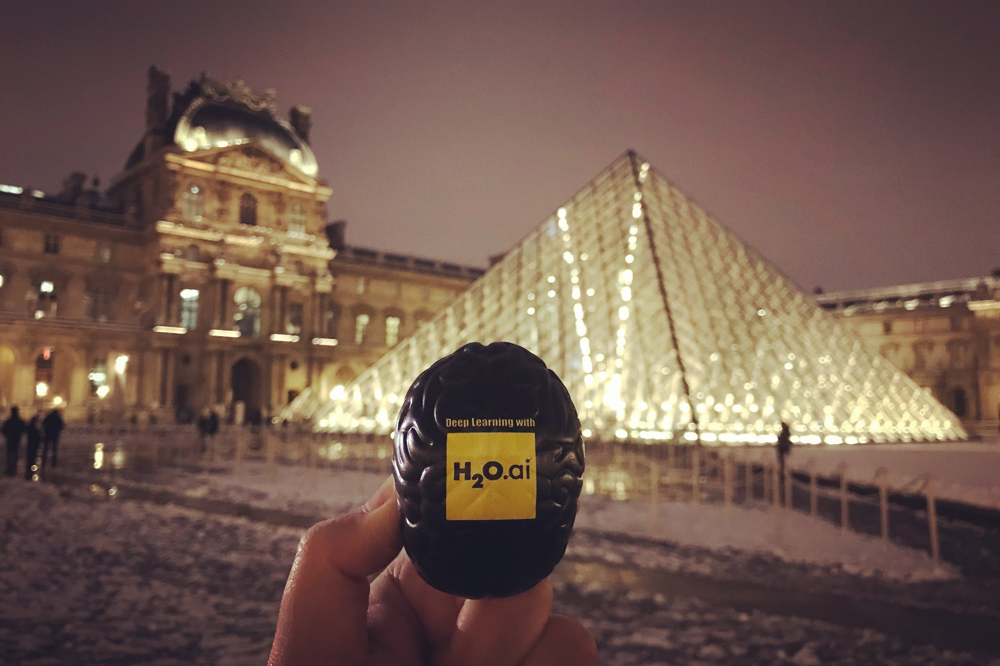
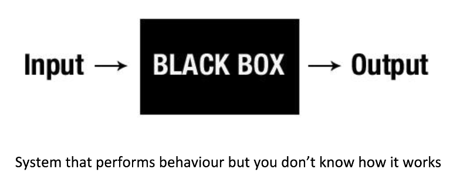
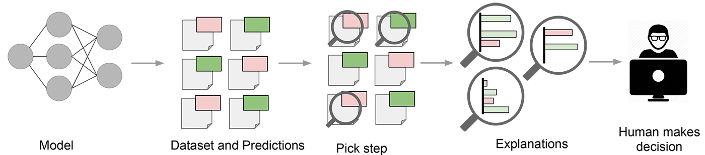
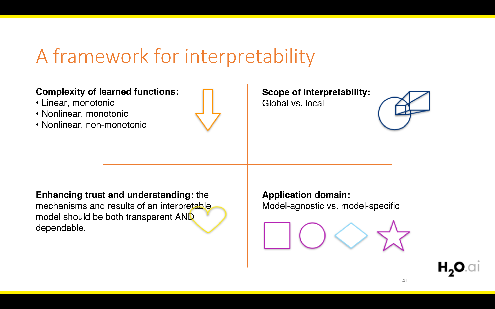
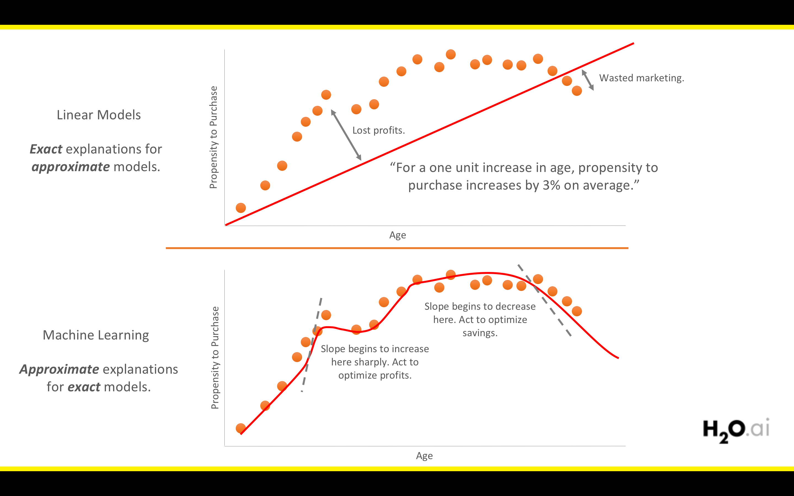
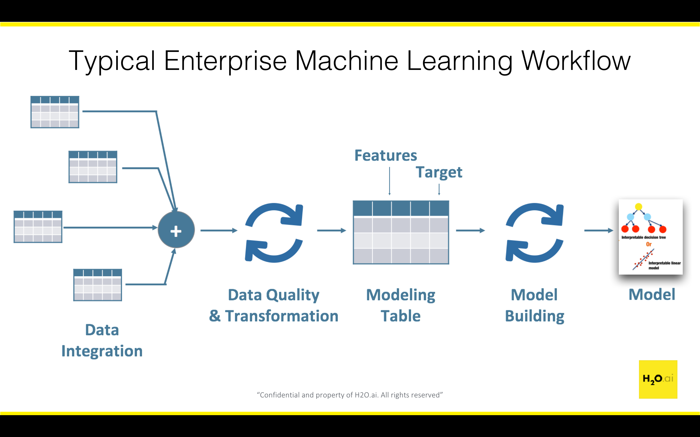
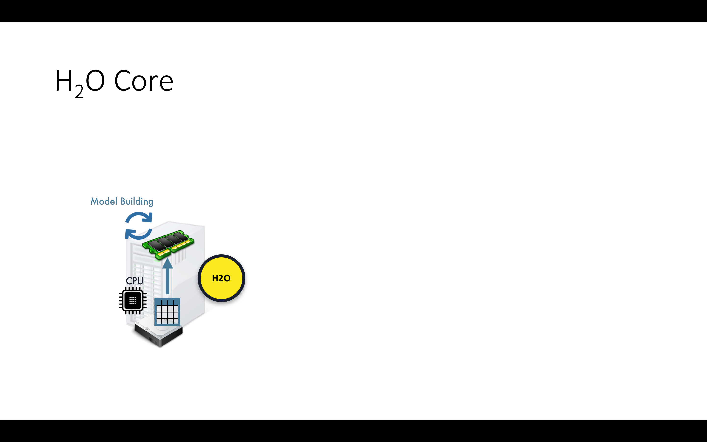
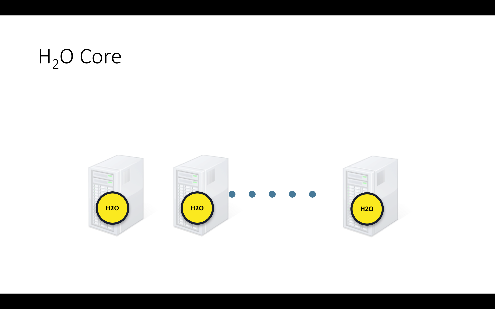
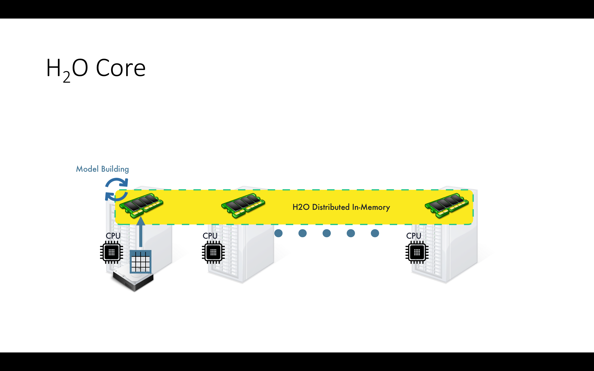
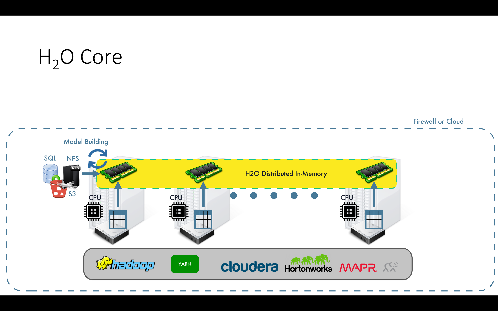

```{r setup, include=FALSE}
options(htmltools.dir.version = FALSE)
options(servr.daemon = TRUE)
```

# About Joe

.pull-left[

- My name is Jo-fai

- Majority of my British friends cannot remember Jo-fai

- Joe is the solution

- Data Scientist at H2O.ai

- For a very long time, I was the only H2O person in UK ...

- Community Manager / Sales Engineer / Photographer / SWAG Distributor

]


.pull-right[

  <center>
  
  <br>
  
  
  
  </center>

]

---

# Agenda

.pull-left[
  
- **Introduction**
    - Why?
    - Interpretable Machine Learning
        - LIME Framework
    - Automatic Machine Learning
        - H2O AutoML
   

- **Worked Examples**
    - Regression
    - Classification

- **Other Stuff + Q & A**

  ]

.pull-right[
  
  <center>
  
  <br>
  
  
  
  <br><br>
  
  
  
  <br><br>

  
  
  </center>
  
]

---

# Acknowledgement


- **Marco Tulio Ribeiro**: Original LIME Framework and Python package

- **Thomas Lin Pedersen**: LIME R package

- **Matt Dancho**: LIME + H2O AutoML example + LIME R package improvement

- **Kasia Kulma**: LIME + H2O AutoML example

- My H2O colleagues **Erin LeDell**, **Ray Peck**, **Navdeep Gill** and many others for AutoML


---

class: inverse, center, middle

# Why?


---

# Why Should I Trust Your Model?

<center>

<br>



</center>


---

class: inverse, center, middle

# Interpretable Machine Learning

---

class: center, middle


Figure 1. Explaining individual predictions to a human decision-maker. Source: Marco Tulio Ribeiro.

<br>



Figure 2. Explaining a model to a human decision-maker. Source: Marco Tulio Ribeiro.

---

class: inverse, center, middle

# The LIME Framework

### Local Interpretable Model-agnostic Explanations

---


class: inverse, center, middle



---

class: inverse, center, middle



---

# How does LIME work?

## Theory

- LIME approximates model locally as logistic or linear model
- Repeats process many times
- Output features that are most important to local models

## Outcome

- Approximate reasoning
- Complex models can be interpreted
    - Neural nets, Random Forest, Ensembles etc.


---

class: inverse, center, middle

# Automatic Machine Learning


---


class: inverse, center, middle




---

.pull-left[

## H2O AutoML

H2O’s AutoML can be used for automating a large part of the machine learning workflow, which includes automatic training and tuning of many models within a user-specified time-limit. The user can also use a performance metric-based stopping criterion for the AutoML process rather than a specific time constraint. Stacked Ensembles will be automatically trained on the collection individual models to produce a highly predictive ensemble model which, in most cases, will be the top performing model in the AutoML Leaderboard.

]

.pull-right[

## R Interface

```r
aml = h2o.automl(x = x, y = y, 
                 training_frame = train, 
                 max_runtime_secs = 3600)
```

## Python Interface
```python
aml = H2OAutoML(max_runtime_secs = 3600)
aml.train(x = x, y = y, 
          training_frame = train)
```

## Web Interface

H2O Flow

]


---

class: inverse, center, middle

# Lime Water


---

# Lime Water in R

.pull-left[

## LIME

```r
# Install 'lime' from CRAN 
install.packages('lime')
```

or

```r
# Install development version from GitHub
devtools::install_github('thomasp85/lime')
```

]

.pull-right[
## H2O

```r
# Install 'h2o' from CRAN 
install.packages('h2o')
```

or

```r
# Install latest stable release from H2O's
# website www.h2o.ai/download/
# Latest Version = 3.18.0.1
# (as of 19-Feb-2018)
install.packages("h2o", type="source",
repos="http://h2o-release.s3.amazonaws.com
/h2o/rel-wolpert/1/R")
```
]

---


class: inverse, center, middle

# Regression Example


---

# Regression Example: Boston Housing

```
Data Set Characteristics:  
 
    - Number of Instances: 506 
    
    - Number of Attributes: 13 numeric/categorical predictive
    
    - Median Value (attribute 14) is the target
 
    - Attribute Information (in order):
        - CRIM     per capita crime rate by town
        - ZN       proportion of residential land zoned for lots over 25,000 sq.ft.
        - INDUS    proportion of non-retail business acres per town
        - CHAS     Charles River dummy variable (= 1 if tract bounds river; 0 otherwise)
        - NOX      nitric oxides concentration (parts per 10 million)
        - RM       average number of rooms per dwelling
        - AGE      proportion of owner-occupied units built prior to 1940
        - DIS      weighted distances to five Boston employment centres
        - RAD      index of accessibility to radial highways
        - TAX      full-value property-tax rate per $10,000
        - PTRATIO  pupil-teacher ratio by town
        - B        1000(Bk - 0.63)^2 where Bk is the proportion of blacks by town
        - LSTAT    % lower status of the population
        - MEDV     Median value of owner-occupied homes in $1000's
 
    - Creator: Harrison, D. and Rubinfeld, D.L.
    - Source: http://archive.ics.uci.edu/ml/datasets/Housing
```

---

# Regression Example: Boston Housing

```{r}
library(mlbench) # for dataset
data("BostonHousing")
dim(BostonHousing)
```

```{r}
# First six samples
knitr::kable(head(BostonHousing), format = "html")
```

---

# Boston Housing (Simple Split)

```{r}
# Define features
features = setdiff(colnames(BostonHousing), "medv")
features
```

```{r}
# Pick four random samples for test dataset
set.seed(1234)
row_test_samp = sample(1:nrow(BostonHousing), 4)
```

```{r}
# Train  
x_train = BostonHousing[-row_test_samp, features]
y_train = BostonHousing[-row_test_samp, "medv"]
```

```{r}
# Test
x_test = BostonHousing[row_test_samp, features]
y_test = BostonHousing[row_test_samp, "medv"]
```


---

# Build a Random Forest (RF)

.pull-left[

```{r, eval=TRUE, echo=FALSE}
suppressPackageStartupMessages(library(caret))
suppressPackageStartupMessages(library(doParallel))
```

```{r, eval=FALSE}
library(caret) # ML framework
library(doParallel) # parallelisation
```

```{r model_rf, cache=TRUE}
# Train a Random Forest using caret
cl = makePSOCKcluster(8)
registerDoParallel(cl)
set.seed(1234)
model_rf = 
  caret::train(
    x = x_train,
    y = y_train,
    method = "rf",
    tuneLength = 3,
    trControl = trainControl(method = "cv")
    )
stopCluster(cl)
```

]

.pull-right[

```{r}
# Print model summary
model_rf
```

]


---


# RF: Making Prediction


```{r}
# Using the Random Forest model to make predictions on test set
yhat_test = predict(model_rf, x_test)
```

```{r}
# Create a new data frame to compare target (medv) and predictions
d_test = data.frame(x_test, 
                    medv = y_test, 
                    predict = yhat_test,
                    row.names = NULL)
knitr::kable(d_test, format = "html")
```

---

# RF: LIME Steps 1 and 2

```{r}
# Step 1: Create an 'explainer' object using training data and model
explainer = lime::lime(x = x_train, model = model_rf)
```

```{r}
# Step 2: Turn 'explainer' into 'explainations' for test set
explainations = lime::explain(x = x_test,
                              explainer = explainer,
                              n_permutations = 5000,
                              feature_select = "auto",
                              n_features = 5)
```


---

# RF: LIME Explainations

```{r}
head(explainations, 5) #LIME Pred: 36.59, Random Forest Pred: 31.64, R^2 = 0.65
```


---


# RF: LIME Visualisation

```{r, fig.width=13, fig.height=5}
# Step 3: Visualise explainations
lime::plot_features(explainations, ncol = 4)
```


---

# H2O AutoML

```{r, echo=FALSE}
suppressPackageStartupMessages(library(h2o))
h2o.no_progress()
```

```{r}
# Start a local H2O cluster (JVM)
library(h2o)
h2o.init(nthreads = -1)
```


---

# Prepare H2O Data Frames

```{r}
# Prepare Data
h_train = as.h2o(BostonHousing[-row_test_samp,])
h_test = as.h2o(BostonHousing[row_test_samp,])
```

```{r}
head(h_test)
```

---

# Train Multiple H2O Models

```{r}
# Train multiple H2O models with a simple API
# Stacked Ensembles will be created from those H2O models
# You tell H2O 1) how much time you have and/or 2) how many models do you want
model_automl = h2o.automl(x = features, 
                          y = "medv",
                          training_frame = h_train,
                          nfolds = 5,
                          max_runtime_secs = 120, # time #<<
                          max_models = 20,        # max models #<<
                          stopping_metric = "RMSE",
                          seed = 1234)
```


---

# H2O: AutoML Model Leaderboard


```{r}
# Print out leaderboard
model_automl@leaderboard
```


---

# H2O: Model Leader

```{r}
# Best Model (either an individual model or a stacked ensemble)
model_automl@leader
```

---

# H2O: Making Prediction


```{r}
# Using the best model to make predictions on test set
yhat_test = h2o.predict(model_automl@leader, h_test)
```

```{r}
# Create a new data frame to compare target (medv) and predictions
d_test = data.frame(x_test, 
                    medv = y_test, 
                    predict = as.data.frame(yhat_test),
                    row.names = NULL)
knitr::kable(d_test, format = "html")
```


---


# H2O: LIME Steps 1 and 2

```{r}
# Step 1: Create an 'explainer' object using training data and model
explainer = lime::lime(x = as.data.frame(h_train[, features]), 
                       model = model_automl@leader)
```

```{r}
# Step 2: Turn 'explainer' into 'explainations' for test set
explainations = lime::explain(x = as.data.frame(h_test[, features]),
                              explainer = explainer,
                              n_permutations = 5000,
                              feature_select = "auto",
                              n_features = 5) # look at top 5 features only
```


---

# H2O: LIME Explainations

```{r}
head(explainations, 5)
```


---


# H2O: LIME Visualisation

```{r, fig.width=13, fig.height=5}
# Step 3: Visualise explainations
lime::plot_features(explainations, ncol = 2)
```


---

class: inverse, center, middle

# Classification Example

---

# Classification Example: Glass

```{r}
library(mlbench) # for dataset
data("Glass")
```

```{r}
# Rename columns
colnames(Glass) = c("Refractive_Index", "Sodium", "Magnesium", "Aluminium",
                    "Silicon", "Potassium", "Calcium", "Barium", "Iron", "Type")
dim(Glass)
str(Glass)
```

---

# Glass (Simple Split)

```{r}
# Define Features
features = setdiff(colnames(Glass), "Type")
features
```

```{r}
# Pick four random samples for test dataset
set.seed(1234)
row_test_samp = sample(1:nrow(Glass), 4)
```


---

# H2O AutoML

```{r, echo=FALSE}
suppressPackageStartupMessages(library(h2o))
h2o.no_progress()
```

```{r}
# Start a local H2O cluster (JVM)
library(h2o)
h2o.init(nthreads = -1)
```


---

# Prepare H2O Data Frames

```{r}
# Prepare Data
h_train = as.h2o(Glass[-row_test_samp,])
h_test = as.h2o(Glass[row_test_samp,])
```

```{r}
head(h_test)
```

---

# Train Multiple H2O Models

```{r}
# Train multiple H2O models with a simple API
# Stacked Ensembles will be created from those H2O models
# You tell H2O 1) how much time you have and/or 2) how many models do you want
model_automl = h2o.automl(x = features, 
                          y = "Type",
                          training_frame = h_train,
                          nfolds = 5,
                          max_runtime_secs = 120, # time #<<
                          max_models = 20,        # max models #<<
                          stopping_metric = "mean_per_class_error",
                          seed = 1234)
```


---

# H2O: AutoML Model Leaderboard


```{r}
# Print out leaderboard
model_automl@leaderboard
```


---

# H2O: Model Leader

```{r}
# Best Model (either an individual model or a stacked ensemble)
model_automl@leader
```

---

# H2O: Making Prediction


```{r}
# Using the best model to make predictions on test set
yhat_test = h2o.predict(model_automl@leader, h_test)
head(yhat_test)
```


---


# H2O: LIME Steps 1 and 2

```{r}
# Step 1: Create an 'explainer' object using training data and model
explainer = lime::lime(x = as.data.frame(h_train[, features]), 
                       model = model_automl@leader)
```

```{r}
# Step 2: Turn 'explainer' into 'explainations' for test set
explainations = lime::explain(x = as.data.frame(h_test[, features]),
                              explainer = explainer,
                              n_permutations = 5000,
                              feature_select = "auto",
                              n_labels = 1, # Explain top prediction only #<<
                              n_features = 5)
```


---


# H2O: LIME Visualisation

```{r, fig.width=13, fig.height=5}
# Step 3: Visualise explainations
lime::plot_features(explainations, ncol = 2)
```


---

class: inverse, center, middle

# Other Stuff


---

class: inverse, center, middle

# H2O in Action

---

class: inverse, center, middle




---

class: inverse, center, middle




---

class: inverse, center, middle




---

class: inverse, center, middle



---

class: inverse, center, middle


---


# Tools & Examples


.pull-left[

## Python Tools

- lime (Original Python Package by Marco Ribeiro) [Link](https://github.com/marcotcr/lime)

## Python Examples

- Marco's Examples [See GitHub README](https://github.com/marcotcr/lime)
- LIME + H2O Example [Link](https://marcotcr.github.io/lime/tutorials/Tutorial_H2O_continuous_and_cat.html)
- LIME in Python by Erin Brown [Link](http://pythondata.com/local-interpretable-model-agnostic-explanations-lime-python/)

]

.pull-right[


## R Examples

- Text Example by Thomas [Link](https://github.com/thomasp85/lime/blob/master/demo/text_classification_explanation.R)
- HR Analytics Example by Matt [Link](https://www.slideshare.net/0xdata/hr-analytics-using-machine-learning-to-predict-employee-turnover)
- Cancer Example by Kasia [Link](https://www.youtube.com/watch?v=CY3t11vuuOM)


]

---

# Related Topics

- SHAP (SHapley Additive exPlanations)
    - A Unified Approach to Interpreting Model Predictions 
        - [Paper](https://arxiv.org/abs/1705.07874)
        - [GitHub](https://github.com/slundberg/shap)
    - http://www.f1-predictor.com/model-interpretability-with-shap/
    


---

# Amsterdam Meetups

## Tue 20 Feb - Sparkling Water in Production Webinar
- Link: https://www.meetup.com/Amsterdam-Artificial-Intelligence-Deep-Learning/events/247630667/

## Thu 22 Feb - Meetup at ING
- Anomaly Detection in Finance using Isolation Forest by **Andreea Bejinaru**
- FoR the HoRde: WoRld of WaR-and SpaRkCRaft by **Vincent Warmerdam**
- Link: https://www.meetup.com/Amsterdam-Artificial-Intelligence-Deep-Learning/events/247356503/


---

class: inverse, center, middle

# Thanks!


### joe@h2o.ai / @matlabulous

### https://github.com/woobe/lime_water/

Slides created via the R package [**xaringan**](https://github.com/yihui/xaringan).
